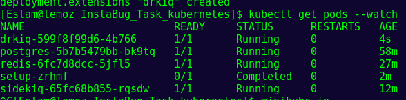
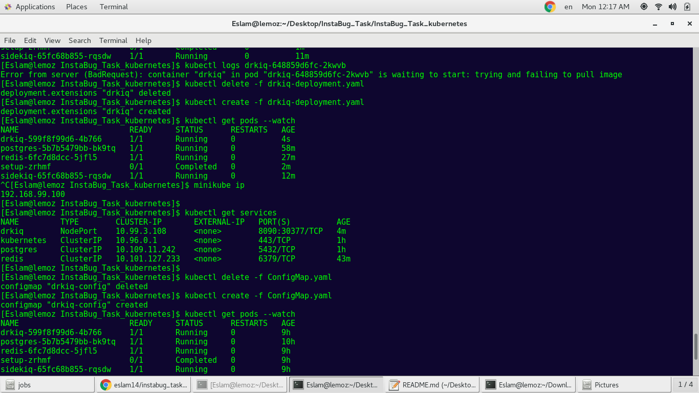
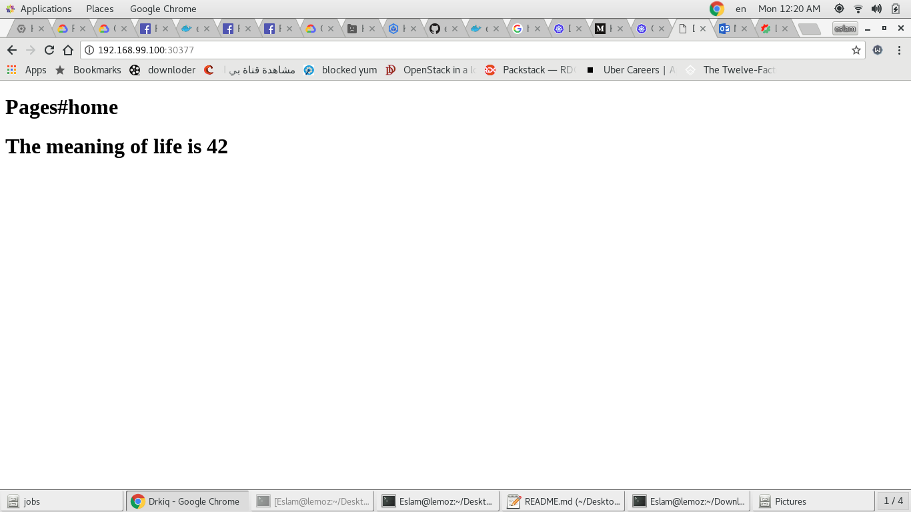

# kubernetes_challenge

I followed this blog post to dockerize a ruby on rails app using Docker compose
blog link:
https://semaphoreci.com/community/tutorials/dockerizing-a-ruby-on-rails-application

github repo for docker tutorial:
https://github.com/Eslam1141/InstaBug_Task

I want to Do it, but with using kubernetes

In order to prep for the Kubernetes deploy ,I packaged the Rails Docker image and pushed it to a Docker registry(DockerHub).
DockerHub repo link 
https://hub.docker.com/r/eslam14/instabug_task

now,I need to translate the docker-compose.yml config into Kubernetes resources.

This is a repo of translation to 
https://github.com/Eslam1141/InstaBug_Kubernetes

steps:

1- start the cluster using minikube
   
   minikube start

2- create the secret to store postgres password and secret token

 kubectl create secret generic postgres-pass --from-literal=password=yourpassword
 
 kubectl create secret generic token --from-literal=password=asecuretokenwouldnormallygohere

 
3- create the Kube resources for postgres
 
 kubectl create -f drkiq-postgres-persistentvolumeclaim.yaml     
 
 kubectl create -f postgres-service.yaml         
 
 kubectl create -f postgres-deployment.yaml       

4- create the kube resources for redis
 
 kubectl create -f drkiq-redis-persistentvolumeclaim.yaml   
 
 kubectl create -f redis-service.yaml     
 
 kubectl create -f redis-deployment.yaml     

5- create the kube resources for sidekiq
 
 kubectl create -f sidekiq-service.yaml    
 
 kubectl create -f sidekiq-deployment.yaml   

6- Kube Job
 
 kubectl create -f job_migration.yaml

7- create app resources
 
 kubectl create -f drkiq-service.yaml   
 
 kubectl create -f drkiq-deployment.yaml   

  
  
# Bonus:
 using configmaps in kubernetes for the environment variables

 kubectl create -f ConfigMap.yaml    
 
 
8- check status of pods
 
  kubectl get pods -w   
  
  
  
  
  
9- get the ip of the cluster
  
  minikube ip
  
10- get the port of drkiq service

kubectl  get services

  

11-open it in the browser

  
  

